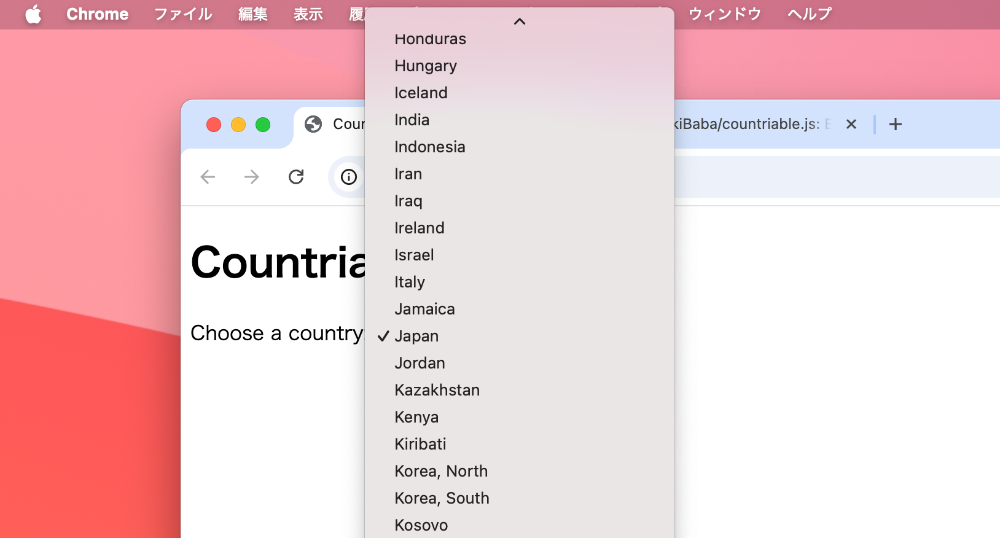

# countriable.js
Easy to insert countries in your select tag.

<!-- 画像の挿入 -->


## Introduction

<en>We have prepared a js function that automatically adds the names of countries in the world as options to the Select tag.</en>

Try it out on here: https://tetsuakibaba.github.io/countriable.js/

## Getting Started

1. Load the countriable.js file from the CDN.
```html
 <script src="https://cdn.jsdelivr.net/gh/TetsuakiBaba/countriable.js/countriable.js"></script>
```

2. Prepare a select tag with a default value in your HTML file.
```html
<select id="countriable" data-default="Japan"></select>
```

3. Make it Countriable when/where you like.
```html
<script>
  makeCountriable('select#countriable'); //use query selector string
</script>
```

3. done!

## License

This project is licensed under the MIT License. See the [LICENSE](LICENSE) file for details.